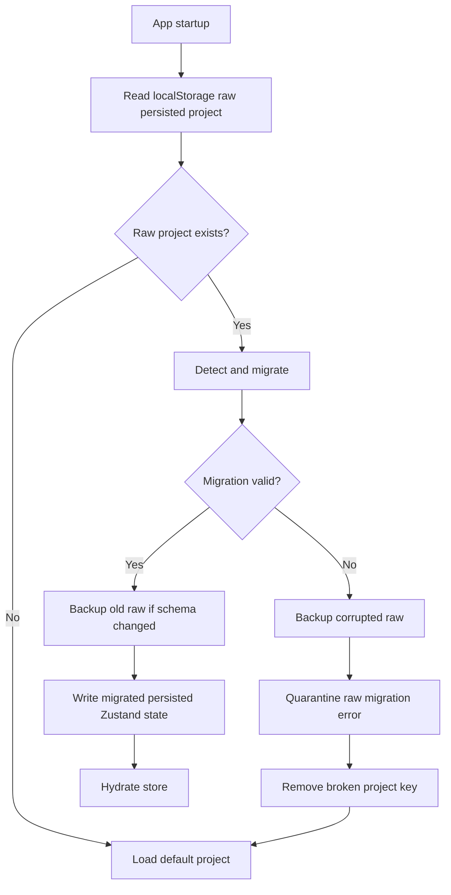

# Kia Electric Lab - Architecture

Architecture policy: append architectural decisions and changes with timestamps. Do not silently change architecture. Any major module movement, state model change, rule-engine change, or persistence change must be documented here for Mehdi and Vi.

## 2026-05-14 13:05 Europe/Istanbul - Phase 1 Architecture Baseline

### Architectural Intent

Kia Electric Lab Phase 1 is a local-first educational simulator. The architecture is intentionally frontend-only for MVP speed, but it is structured so the core simulation logic can later move into a shared package or Tauri/SQLite desktop architecture.

The most important Phase 1 architectural principle is separation of concerns:

- UI renders and collects user actions.
- Store owns editable project state.
- Data files define educational assumptions.
- Engine files calculate electrical, safety, cost, and report outputs.
- Type files define contracts between all modules.

### Current Folder Structure

```text
src/
  components/
    Icon.tsx
    StatCard.tsx
  data/
    apartment.ts
    appliances.ts
    electricalTables.ts
  features/
    appliance-library/
      ApplianceLibrary.tsx
    circuit-builder/
      CircuitBuilder.tsx
    cost-engine/
      CostPanel.tsx
      costEngine.ts
    floor-plan/
      FloorPlan.tsx
    report-engine/
      ReportPanel.tsx
      reportEngine.ts
      reportEngine.test.ts
    safety-engine/
      electricalMath.ts
      electricalMath.test.ts
      SafetyPanel.tsx
      safetyEngine.ts
  store/
    useLabStore.ts
  types/
    electrical.ts
  utils/
    format.ts
  App.tsx
  main.tsx
  styles.css
```

### Module Responsibilities

#### `src/types/electrical.ts`

Defines the shared domain contract for the entire simulator:

- Appliance model
- Room model
- Electrical component model
- Circuit model
- Wire model
- Breaker model
- Cost item model
- Safety warning model
- Project report model
- Complete electrical project model

This file is the current source of truth for project data shape.

#### `src/data/appliances.ts`

Defines the Phase 1 common appliance library. Each appliance has:

- ID
- Persian display name
- Wattage
- Voltage
- Category
- Icon key

The category is used by the safety engine to identify lights, heavy loads, stable loads, and normal small loads.

#### `src/data/electricalTables.ts`

Defines the simplified educational tables for:

- Wire size
- Wire ampacity
- Wire price per meter
- Wire resistance per meter
- Breaker ratings
- Breaker prices
- Unit material and labor costs

Future architecture recommendation: convert this into a versioned profile file so cost and rule assumptions can vary by lesson, market, or country.

#### `src/data/apartment.ts`

Defines:

- Room geometry for the default 100 sqm apartment.
- Initial visible components.
- Default demo project and starter circuits.

This is currently static data. Future versions should allow selectable apartment templates.

#### `src/store/useLabStore.ts`

Owns application state:

- `project`
- `selectedCircuitId`
- `darkMode`

Owns state mutations:

- Reset project
- Add component
- Add circuit
- Select circuit
- Update circuit
- Assign appliance to circuit
- Assign component to circuit

Persistence:

- Uses Zustand `persist` middleware.
- Storage key: `kia-electric-lab-project`.
- Persists project, selected circuit, and dark mode.

Architectural risk:

- No schema version or migration exists. This must be addressed before long-term persistence or Tauri migration.

#### `src/features/safety-engine/electricalMath.ts`

Pure electrical calculation layer:

- Current
- Power
- Resistance
- Total load
- Circuit load
- Wire lookup
- Wire capacity validation
- Breaker/wire compatibility validation
- Approximate voltage drop
- Project total load

This file should remain UI-independent.

#### `src/features/safety-engine/safetyEngine.ts`

Rule evaluation layer:

- Creates Persian warnings.
- Checks whole-project overload.
- Checks circuit overload.
- Checks wire capacity.
- Checks breaker-wire compatibility.
- Checks multiple heavy appliances.
- Checks mixed lighting/outlet loads.
- Checks approximate voltage drop.
- Checks overdesign.
- Checks refrigerator stability/dedication.
- Checks kitchen circuit count.
- Checks bathroom outlet risk.
- Checks unknown appliance IDs.

Architectural risk:

- Rules are currently procedural. As the platform grows, this should become a rule registry or profile-based rule engine.

#### `src/features/cost-engine/costEngine.ts`

Cost calculation layer:

- Calculates circuit-level cost items.
- Calculates material cost.
- Calculates labor cost.
- Calculates total circuit cost.
- Calculates approximate overdesign cost.
- Aggregates project cost.
- Calculates cost by circuit and room.

Architectural risk:

- Cost model is hardcoded.
- Currency is implicit.
- Cost values have no effective date/version.
- Room cost distribution is approximate.

#### `src/features/report-engine/reportEngine.ts`

Report and scoring layer:

- Generates full `ProjectReport`.
- Aggregates loads, costs, warnings, wire usage, economic suggestions, recommended corrections, and scores.
- Calculates scores from warning counts, configured circuit count, kitchen separation, and overdesign cost.

Architectural risk:

- Scoring weights are hardcoded and should eventually be configurable by lesson mode.

#### UI Components

UI modules consume state and engine outputs:

- `App.tsx`: page layout, RTL enforcement, dashboard cards.
- `ApplianceLibrary.tsx`: component/appliance palette and drag data.
- `FloorPlan.tsx`: apartment visualization and drag/drop placement.
- `CircuitBuilder.tsx`: circuit list and circuit configuration controls.
- `SafetyPanel.tsx`: warning display.
- `CostPanel.tsx`: cost summary display.
- `ReportPanel.tsx`: final report display.

### State Flow

Current flow:

1. Static defaults are loaded from `src/data/apartment.ts`.
2. Zustand initializes `project` state with `defaultProject`.
3. Zustand persistence restores previous local browser state if available.
4. User actions mutate state through store actions.
5. UI components read project state through `useLabStore`.
6. UI components call pure engines with current project data.
7. Engines return derived values.
8. UI renders Persian dashboard, safety warnings, cost outputs, and report.

Important: derived values are not currently stored. They are recalculated from project state. This is good for correctness and avoids stale derived state.

### Simulation Engine Design

Phase 1 does not have a single `simulationEngine` module. Instead, simulation concerns are split by responsibility:

- Electrical math: `electricalMath.ts`
- Safety rules: `safetyEngine.ts`
- Cost calculations: `costEngine.ts`
- Report and scoring: `reportEngine.ts`

This is acceptable for MVP. For Phase 2 or Phase 3, consider introducing:

- `simulation-profile`
- `rule-registry`
- `project-normalizer`
- `project-validator`
- `report-snapshot`

### UI Architecture

The UI is card-based and Persian RTL. It uses TailwindCSS classes directly in components.

Layout:

- Header and top KPI cards in `App.tsx`.
- Main content grid with:
  - Left: palette/library
  - Center: floor plan, circuit builder, report
  - Right: safety and cost panels

React Flow architecture:

- Rooms are rendered as non-draggable background nodes.
- Components are rendered as nodes over rooms.
- Circuit membership is visualized with edges from main panel to assigned components.
- Drag/drop uses `dataTransfer` payloads and `screenToFlowPosition`.

Limitations:

- Nodes are not draggable after placement.
- Wire path geometry is not modeled.
- Edges are not true electrical topology.

### Safety Engine Architecture

Current safety engine inputs:

- `ElectricalProject`
- Each `Circuit`
- Appliance table
- Wire table

Current safety engine output:

- Array of `SafetyWarning`.

Warning levels:

- `danger`
- `warning`
- `info`

Current safety engine behavior:

- Evaluates whole-project rules first.
- Evaluates each circuit.
- Evaluates cross-cutting room/appliance conditions.
- Returns warnings for UI and report engine.

Future safety architecture:

- Convert rules to typed rule objects.
- Add rule IDs and categories.
- Add severity policy by lesson mode.
- Add unit tests per rule.
- Add explainable rule metadata:
  - trigger
  - formula
  - educational explanation
  - recommended correction
  - professional disclaimer

### Cost Engine Architecture

Current cost engine inputs:

- `Circuit`
- Optional `ElectricalProject`
- Wire table
- Breaker table
- Unit cost table

Current cost engine output:

- Circuit-level items and totals.
- Project-level aggregate totals.

Current cost categories:

- material
- labor

Current cost limitations:

- Costs are static placeholders.
- Currency is displayed as toman in UI but not encoded in data model.
- No supplier or date metadata.
- No regional pricing.
- No uncertainty range.

Future cost architecture:

- Versioned cost profile.
- Currency metadata.
- Effective date.
- Editable cost assumptions.
- Import/export of cost profiles.
- Overdesign explanation with exact alternative wire recommendation.

### Report Engine Architecture

The report engine composes:

- Project load from electrical math.
- Cost totals from cost engine.
- Safety warnings from safety engine.
- Wire usage from circuits.
- Economic suggestions from overdesign warnings.
- Recommended corrections from non-info warnings.
- Scores from warning and configuration heuristics.

This module is the correct place to prepare AI tutor context in later phases, because it already composes the complete educational state.

### Data Model Relationships

High-level relationship:

```text
ElectricalProject
  voltage
  mainBreakerAmp
  rooms[]
  components[]
  circuits[]

Circuit
  roomIds[] -> Room.id
  componentIds[] -> ElectricalComponent.id
  applianceIds[] -> Appliance.id
  wireSizeMm2 -> Wire.sizeMm2
  breakerAmp -> Breaker.amp
```

Important current design note:

- Appliances are not component instances. Circuits store `applianceIds`, and components may also reference `applianceId`.
- This is enough for MVP but may become limiting when the same appliance type appears multiple times.

Future recommendation:

- Introduce `PlacedLoad` or `LoadInstance` with unique ID, appliance type, room, circuit, and custom wattage override.

### Persistence Architecture

Current:

- Browser local storage via Zustand.

Missing:

- Version number.
- Migration system.
- Data validation.
- Project import/export.
- Conflict recovery.

Future:

- Add `schemaVersion` to `ElectricalProject`.
- Add local migrations.
- Add JSON import/export.
- Add SQLite adapter for Tauri.
- Keep engines storage-agnostic.

### Testing Architecture

Current:

- Vitest configured.
- Tests exist for electrical math and report generation.

Missing:

- UI tests.
- Store tests.
- Rule-by-rule safety tests.
- Cost engine tests.
- Persistence migration tests.
- Visual regression tests.

Recommended testing direction:

1. Add cost engine unit tests.
2. Add safety warning unit tests per rule.
3. Add store mutation tests.
4. Add Playwright/Codex browser smoke tests after UI stabilizes.

### Architecture Quality Assessment

The current architecture is strong for Phase 1. It satisfies the most important principle: calculation logic is not embedded directly inside UI components. The data model is clear, and feature directories make ownership reasonably obvious.

The largest architectural gap is that the simulator does not yet distinguish visual topology from electrical topology. React Flow currently renders visual nodes and simple edges, but the true circuit model is still a list of circuits with IDs. This is fine for MVP but must be addressed before advanced circuit simulation, automatic wire-length calculation, or multiplayer editing.

### Architectural Risks

- UI can become too large if future features are added directly to existing components.
- Procedural safety rules can become hard to manage without a rule registry.
- Static data tables can become hard to version without profiles.
- Local storage can break across schema changes.
- Appliance IDs as load references are too coarse for repeated identical appliances.
- No single source of truth exists for visual wire path geometry.

### Architectural Next Steps

Recommended Phase 2 architecture work:

- Add `.gitignore` and initialize repository.
- Add schema version to `ElectricalProject`.
- Introduce `LoadInstance` or `PlacedLoad`.
- Add safety rule registry abstraction.
- Add cost profile abstraction.
- Add project import/export.
- Add circuit/component deletion and editing.
- Add tests around safety and cost engines.

## 2026-05-14 13:25 Europe/Istanbul - Version Control Architecture

### Change Type

Engineering-process architecture. No runtime source architecture changed.

### Git Branch Architecture

The project now uses:

- `main` for stable releases.
- `develop` for active integration.
- `feature/*` for isolated work.
- `experimental/*` for risky prototypes and research.

### Baseline Anchor

The tag `v0.1-phase1-baseline` marks the stable Phase 1 baseline. This tag is the first formal recovery anchor for the project.

### Documentation Coupling

Future architecture, electrical-rule, cost-rule, and persistence changes must include corresponding updates under `project-docs/` before they are considered complete.

### Reason

Kia Electric Lab is expected to grow into a larger educational simulator and AI-assisted platform. Branch strategy and tagged baselines are required to preserve architectural continuity and allow safe rollback.

## 2026-05-14 13:40 Europe/Istanbul - Phase 2 Topology Engine Architecture

### Change Type

Runtime simulation architecture.

### Architecture Goal

Make the electrical engine the source of truth for circuit connectivity while keeping React Flow as visualization only.

### New Module Layout

```text
src/features/
  topology-engine/
    types.ts
    terminalCatalog.ts
    topologyEngine.ts
    topologyEngine.test.ts
  current-engine/
    currentEngine.ts
  validation-engine/
    validationEngine.ts
```

### Module Responsibilities

#### `topology-engine/types.ts`

Defines graph-level types:

- `ElectricalTerminal`
- `TopologyNode`
- `TopologyWire`
- `ElectricalTopologyGraph`
- terminal key helpers
- wire helper utilities

#### `topology-engine/terminalCatalog.ts`

Defines electrical terminals exposed by component types:

- Main panel:
  - `phase-source`
  - `neutral-source`
- Virtual breaker:
  - `line-in`
  - `load-out`
- Physical breaker:
  - `line-in`
  - `load-out`
- One-way switch:
  - `line-in`
  - `line-out`
- Two-gang switch:
  - `line-in`
  - `line-out-1`
  - `line-out-2`
- Outlet/lamp/appliance:
  - `phase`
  - `neutral`
- Junction box:
  - phase junction
  - neutral junction
- Wire path:
  - endpoint A
  - endpoint B

#### `topology-engine/topologyEngine.ts`

Builds the graph:

- Converts project components into topology nodes.
- Creates virtual breaker nodes for each circuit.
- Converts explicit `project.wires` into topology edges when available.
- Generates deterministic educational wires from circuit membership when explicit wires are absent.
- Builds adjacency maps for traversal.
- Provides terminal traversal.

Important design:

- Generated topology is a compatibility bridge, not a substitute for future wire-routing UI.
- Explicit wires will become the authoritative topology once UI supports drawing wires.

#### `current-engine/currentEngine.ts`

Simulates simplified educational current flow:

- Finds load components.
- Checks phase/neutral connectivity.
- Calculates load current from appliance watts.
- Calculates total current per breaker/circuit.
- Calculates current through each wire.
- Calculates voltage drop per wire.
- Flags wire overloads.

#### `validation-engine/validationEngine.ts`

Creates graph-based Persian warnings:

- Missing/invalid breaker path.
- Open phase.
- Open neutral.
- Incomplete loop.
- Invalid switch wiring.
- Direct phase-neutral short.
- Breaker overload from graph load.
- Wire overload from propagated current.

### Source Of Truth Rule

Electrical connectivity must be read from the topology engine, not from React Flow edges.

React Flow may display:

- Rooms.
- Components.
- Visual connections.
- Future wire paths.

But React Flow must not own:

- Electrical terminals.
- Circuit validity.
- Current propagation.
- Safety conclusions.
- Wire overload logic.

### Data Model Change

`ElectricalProject` now supports optional `wires?: ElectricalWire[]`.

`ElectricalWire` includes:

- `id`
- `circuitId`
- `from`
- `to`
- `lengthMeters`
- `wireSizeMm2`
- optional Persian label

This creates the future bridge to real wire-routing UI.

### Current Topology Generation Strategy

When explicit wires do not exist:

1. A virtual breaker node is created for each circuit.
2. Panel phase is connected to breaker input.
3. Breaker output connects to load phase terminals.
4. Load neutral terminals connect to panel neutral.
5. If a switch exists in a lighting circuit, generated phase routing can pass through the switch before lamp phase.

This generated graph is deterministic and testable. It allows Phase 1 projects to be analyzed by Phase 2 engines immediately.

### Scalability Notes

This architecture can later support:

- Real wire routing.
- Advanced voltage drop.
- Three-phase systems.
- Grounding systems.
- Smart-home simulation.
- Solar systems.
- UPS systems.
- Generator backup.

Required future evolution:

- Add `TopologyProfile` or `SystemProfile`.
- Add grounding terminal roles.
- Add multi-phase terminal roles.
- Add protective device models.
- Add explicit switch-state simulation.
- Add graph normalization and validation for large projects.

### Architecture Risks

- Generated topology can hide missing visual wire-routing UI if not clearly documented.
- Current engine assumes educational radial/branch behavior, not a full circuit solver.
- `main-panel` is still treated as the canonical panel ID in parts of validation/current logic.
- Load instances are still tied to component `applianceId`; repeated identical loads need a `LoadInstance` model.

### Next Architecture Step

Implement real wire-routing UI that writes explicit `ElectricalWire[]` to project state. After that, generated topology should remain only as a migration/fallback mode.

## 2026-05-14 14:20 Europe/Istanbul - Phase 3 Wire Routing UI Architecture

### Change Type

UI and state architecture connected to the Phase 2 topology engine.

### Core Rule

`ElectricalWire[]` is now the user-authored electrical source of truth when present. React Flow renders wire edges from that state but does not own simulation truth.

### New Module

```text
src/features/wire-routing/
  WireRoutingPanel.tsx
```

### Updated Modules

- `src/features/floor-plan/FloorPlan.tsx`
- `src/store/useLabStore.ts`
- `src/features/topology-engine/wireFactory.ts`
- `src/features/topology-engine/wireFactory.test.ts`
- `src/features/topology-engine/terminalCatalog.ts`
- `src/types/electrical.ts`

### State Flow

1. User enables wire drawing mode.
2. User clicks a terminal rendered on a component or virtual breaker.
3. Store records `pendingTerminal`.
4. User clicks a second terminal.
5. Store calls pure `createElectricalWire`.
6. `wireFactory` validates terminal compatibility.
7. If valid, store appends the wire to `project.wires`.
8. Floor plan renders the explicit wire.
9. Topology engine uses `project.wires` as graph edges.
10. Current engine and validation engine calculate status from explicit topology.

### Terminal Rendering

Terminals are rendered from the terminal catalog:

- Panel: phase, neutral, earth placeholder.
- Virtual breaker: line input, load output.
- Switches: line input and switched outputs.
- Outlet: phase, neutral, earth placeholder.
- Lamp/appliance: phase and neutral.

### Wire Inspector Architecture

`WireRoutingPanel` composes:

- Store wire state.
- Current simulation results.
- Terminal lookup from topology graph.
- Wire validation.
- Wire catalog data.
- Cost estimate.
- Topology warnings.

It does not calculate electrical truth independently; it displays outputs from engines.

### Remaining Architecture Limitation

React Flow edges are used to visually draw wires between component nodes. This is acceptable because the edge list is derived from `ElectricalWire[]`. The edge layer must never become the source of truth.

### Next Architecture Step

Add real path geometry for wires so a wire can have intermediate route points and measured length instead of a manually edited length.

## 2026-05-14 15:00 Europe/Istanbul - Phase 4 Geometry And Panelboard Architecture

### Change Type

Simulation geometry, UI architecture, panelboard validation, and cost integration.

### New Modules

```text
src/features/topology-engine/
  terminalGeometry.ts
  wireGeometry.ts
  wireGeometry.test.ts
src/features/panelboard-engine/
  panelboardEngine.ts
  panelboardEngine.test.ts
src/features/panelboard/
  PanelboardPanel.tsx
```

### Geometry Architecture

`terminalGeometry.ts` owns:

- default pixels-per-meter scale
- terminal coordinate calculation
- virtual breaker coordinates
- snap-to-grid behavior

`wireGeometry.ts` owns:

- path-point assembly from terminal start, bend points, and terminal end
- pixel length calculation
- pixel-to-meter conversion
- wire length calculation
- bend insertion
- bend update
- bend deletion
- route reset

### Source Of Truth Rule

`ElectricalWire[]` remains source of truth. React Flow is only used to display rooms/components. Routed wires are drawn as SVG polylines derived from explicit wire data and terminal geometry.

### Panelboard Architecture

Panelboard data is optional:

- If `project.panelboard` exists, it is used.
- If it does not exist, panelboard UI derives default slots from existing circuits for backward compatibility.

`panelboardEngine.ts` validates:

- circuit without breaker
- breaker without circuit
- overloaded breaker
- breaker/wire incompatibility

### Cost Architecture

Cost engine now uses geometric explicit wire length for circuits when `project.wires` exist. If no explicit wires exist, it falls back to circuit estimated length for Phase 1 compatibility.

### Remaining Architecture Limitations

- Wire route points are simple bend coordinates, not full conduit/routing objects.
- Terminal coordinates are deterministic offsets from component positions, not DOM-measured handle coordinates.
- Panelboard slots are educational and simple; no physical DIN rail/panel layout model yet.

## 2026-05-14 15:25 Europe/Istanbul - Phase 5 Persistence And Migration Architecture

### Change Type

Project schema governance, local storage safety, migration, backup, restore, and data integrity validation.

### New Modules

```text
src/migrations/
  projectMigration.ts
  storageSafety.ts
  projectMigration.test.ts

src/features/project-data/
  ProjectDataPanel.tsx
```

### Schema Ownership

`ElectricalProject` now owns persistent metadata:

- `schemaVersion`
- `appVersion`
- `createdAt`
- `updatedAt`

This metadata travels with the project object rather than only the storage layer. That makes the schema portable to future Tauri + SQLite, JSON export/import, and possible shared project files.

### Migration Engine Design

`projectMigration.ts` is pure TypeScript:

- `detectProjectVersion(project)`
- `migrateProject(project)`
- `validateMigratedProject(project)`
- `parsePersistedProject(raw)`

Detection supports:

- Phase 1 shape: no wires/schema metadata
- Phase 2 shape: `wires` exists
- Phase 3 shape: explicit wires with `kind`
- Phase 4 shape: `pixelsPerMeter` or `panelboard`
- Phase 5 shape: explicit `schemaVersion`

Migration is deterministic and upgrades all known old shapes to current schema version 5.

### Storage Safety Flow



### State Flow

- `storageSafety.preparePersistedProjectStorage()` runs before Zustand `persist` hydration.
- Zustand hydrates only a valid latest-shape project or the safe default project.
- Store actions update `updatedAt`, `schemaVersion`, and `appVersion` through `touchProject`.
- `ProjectDataPanel` can replace the current project after import/restore using `replaceProject`.

### UI Architecture

`ProjectDataPanel` is an operational tool panel in the right-side column. It shows:

- schema version
- app version marker
- last saved time
- export JSON button
- import JSON button
- safe reset button
- automatic backup list
- corrupted data export when quarantine exists

The panel does not calculate simulation results. It only manages project persistence state.

### Validation Boundary

Migration validation confirms structural integrity, not professional electrical approval. It checks arrays, schema version, route points, wire terminal references, breaker assignment references, breaker amps, and scale. Electrical safety remains owned by the topology, validation, safety, panelboard, and cost engines.

### Future Architecture Notes

- SQLite migration should call the same pure migration engine before opening/saving project rows.
- Schema version should also be stored at database level when Tauri arrives.
- Future project sharing/multiplayer will need merge/conflict semantics beyond this single-document migration model.

## 2026-05-14 15:45 Europe/Istanbul - Phase 6 Diagnostics And Repair Architecture

### Change Type

Project integrity diagnostics, conservative repair engine, export checksum, backup management, and browser-level storage migration fixtures.

### New Modules

```text
src/diagnostics/
  diagnosticsEngine.ts
  repairEngine.ts
  diagnosticsEngine.test.ts

src/migrations/
  exportIntegrity.ts
  storageSafety.test.ts

src/features/project-diagnostics/
  ProjectDiagnosticsPanel.tsx
```

### Diagnostics Engine Architecture

`diagnosticsEngine.ts` owns:

- `DiagnosticIssue`
- `DiagnosticSeverity`
- `DiagnosticCategory`
- `diagnoseProject(project)`

It scans the current project and returns immutable issue records with severity, category, Persian title, Persian explanation, recommended repair, safe auto-repair flag, and optional entity id.

### Repair Engine Architecture

`repairEngine.ts` owns:

- `repairProject(project, selectedIssueIds?)`
- repair logs
- skipped issue reporting

Repair receives a project snapshot, runs diagnostics, applies only safe repairs, and returns a new project snapshot. Zustand applies the result through `replaceProject`.

### Export Integrity Architecture

`exportIntegrity.ts` wraps project exports in an envelope:

```text
{
  format,
  exportedAt,
  checksumAlgorithm,
  checksum,
  project
}
```

Import accepts both new envelopes and legacy raw project JSON. Checksum mismatch produces a warning rather than an automatic hard failure so Mehdi/Vi can still recover data intentionally.

### UI Architecture

`ProjectDiagnosticsPanel`:

- shows severity counts
- filters issues by category
- lists Persian issue explanations
- offers repair of safe issues
- exports diagnostic report JSON

`ProjectDataPanel` now also:

- shows backup schema version
- restores backups
- exports backups
- deletes backups
- exports corrupted data
- supports reset after corrupted data is found

### Boundary Rules

- Diagnostics and repair are data-quality systems, not electrical approval systems.
- Topology, current, safety, panelboard, and cost engines remain responsible for simulation calculations.
- Repair must not hide unsafe electrical design; it only repairs invalid data references and storage shape problems.

### Future Architecture Notes

- Add per-issue repair commands.
- Add undo history for repair operations.
- Add diagnostics as an input channel for a future AI electrical tutor.
- Add incremental diagnostics for large projects.

## 2026-05-14 16:10 Europe/Istanbul - Phase 7 Lesson Mode Architecture

### Change Type

Educational platform layer, guided lesson validation, progress persistence, and Persian RTL learner UI.

### New Modules

```text
src/features/lesson-mode/
  lessonEngine.ts
  lessonValidation.ts
  lessonProgress.ts
  LessonPanel.tsx
```

### Lesson Engine Architecture

`lessonEngine.ts` owns static lesson definitions:

- id
- title
- difficulty
- learning goals
- required components
- target behavior
- steps
- validation rules
- explanation
- success criteria
- hints
- common mistakes

### Lesson Validation Architecture

`lessonValidation.ts` owns lesson-specific success criteria and score generation. It calls existing simulator engines instead of duplicating formulas:

- topology traversal
- safety warnings
- panelboard warnings
- cost engine
- current/topology infrastructure where appropriate

### Lesson Progress Architecture

`lessonProgress.ts` owns pure progress transforms:

- create empty progress
- set active lesson
- record hint usage
- record validation attempt
- calculate progress percentage

`ElectricalProject.lessonProgress` stores persistent educational progress and is migrated into schema version 6.

### UI Architecture

`LessonPanel.tsx` renders:

- lesson list
- active lesson instructions
- step checklist
- hint box
- validate button
- progress percentage
- score cards
- completion badges
- current-circuit wiring reset action

### State Flow

```text
LessonPanel -> useLabStore action -> pure lessonProgress function -> project snapshot -> Zustand persist
LessonPanel -> validateLesson(project) -> existing engines -> feedback/score -> recordLessonValidation
```

### Boundary Rules

- Lesson UI does not calculate electrical truth.
- Lesson validation does not approve real-world electrical work.
- Lesson validation may express educational criteria that are more specific than generic safety warnings.
- Existing topology/current/safety/cost engines remain the source of calculations.

### Future Architecture Notes

- Move lesson content to versioned lesson packs when lessons grow.
- Add reusable validation rule primitives.
- Add lesson-specific starter project snapshots.
- Add floor-plan highlighting for next required action.
- Add AI tutor layer over `LessonValidationResult`.

## 2026-05-14 18:35 Europe/Istanbul - Phase 8 Lesson Sandbox Architecture

### Change Type

Lesson isolation, data-driven templates, explicit topology enforcement, sandbox persistence, and guided floor-plan highlighting.

### New Module

```text
src/features/lesson-mode/
  lessonSandbox.ts
  lessonSandbox.test.ts
```

### Sandbox State Flow

```text
Main project active
  -> startLessonSandbox(lessonId)
  -> store mainProject snapshot
  -> create lessonProject from template
  -> active project becomes sandboxProject
  -> learner edits sandbox
  -> exit restores mainProject OR apply replaces main project after confirmation
```

### Template Architecture

Each lesson template defines:

- lesson id
- focus room
- required circuit
- pre-placed components
- panelboard breaker assignment

Templates intentionally start with no wires and `useExplicitWiresOnly = true` so user-authored wiring is required.

### Highlight Architecture

`generateLessonHighlight(project, lessonId, stepIndex)` returns:

- room ids to highlight
- component ids to highlight
- terminal refs to highlight
- invalid wire ids
- optional ghost wire suggestion
- Persian message

`FloorPlan` consumes this data and remains a renderer only.

### Store Architecture

`useLabStore` now persists:

- active project
- optional `lessonSandbox`
- selected circuit/wire UI state

Sandbox actions:

- `startLessonSandbox`
- `resetLessonSandbox`
- `exitLessonSandbox`
- `applyLessonSandboxToMainProject`
- `saveSandboxAsExample`

### Boundary Rules

- Sandbox engine is independent from React.
- React confirms before applying sandbox result to main project.
- Generated topology fallback is disabled only when `useExplicitWiresOnly` is true.
- Main project must be restorable until explicit apply.

### Future Architecture Notes

- Add append/merge apply strategies.
- Add lesson example library.
- Move templates into versioned lesson-pack data.
- Add explicit per-step terminal guidance instead of fallback guidance.

## 2026-05-14 20:35 Europe/Istanbul - Phase 9 Sandbox Apply And Example Architecture

### Change Type

Sandbox output management, pure append/replace apply logic, saved example data model, and diagnostics-aware apply results.

### Apply Modes

```text
replace      -> sandbox project becomes main project
append       -> lesson circuit/components/wires are copied into main project
save-example -> project remains unchanged; sandbox snapshot is saved as example
```

### Append Architecture

`appendSandboxToMainProject`:

- reads immutable main project snapshot
- reads current sandbox project
- generates collision-safe ids
- remaps circuit ids
- remaps component ids
- remaps wire endpoint refs
- remaps virtual breaker refs
- remaps panelboard breaker assignments
- runs diagnostics on the resulting project

### Example Architecture

`LessonExample` stores:

- id
- lessonId
- title
- projectSnapshot
- score
- createdAt
- notes

Example operations are pure:

- create
- add
- delete
- load into sandbox
- export JSON through UI

### UI Architecture

`LessonPanel` now includes:

- apply mode selector
- affected counts
- Persian confirmation with exact operation
- example naming
- saved example list
- load/delete/export actions
- post-apply diagnostic issue count message

### Boundary Rules

- The main project is never changed by save-example mode.
- Replace/append require explicit user confirmation.
- Append logic remains independent from React UI.
- Diagnostics after apply are advisory and do not silently block recovery workflows.

### Future Architecture Notes

- Replace `window.confirm` with an in-app modal.
- Add example import and checksum validation.
- Add collision-aware component placement.
- Move saved examples to durable database storage later.

## 2026-05-14 21:30 Europe/Istanbul - Phase 10 Apply Preview, Example Integrity, Layout, And Splitting Architecture

### Change Type

Apply-preview UX, collision-aware append layout, example artifact integrity, and frontend code splitting.

### Apply Preview Architecture

`createSandboxApplyPreview` returns:

- apply mode
- affected counts
- diagnostics report
- Persian explanation of what will happen
- Persian risk list

`LessonPanel` renders this data in an in-app RTL modal and only applies after the user presses confirm.

### Collision-Aware Append Architecture

Append now:

- scans occupied main-project component positions
- evaluates candidate offsets
- chooses the first offset without nearby overlap
- preserves relative sandbox layout
- offsets route points by the same vector

### Example Integrity Architecture

Lesson examples now have a checksum envelope:

```text
{
  format: "kia-electric-lab-lesson-example",
  exportedAt,
  checksumAlgorithm,
  checksum,
  example
}
```

Import validates checksum and reports Persian warnings on mismatch or raw JSON import.

### Code Splitting Architecture

`App.tsx` lazy-loads:

- `LessonPanel`
- `ProjectDataPanel`
- `ProjectDiagnosticsPanel`

Each panel has a Persian loading fallback through `Suspense`.

### Future Architecture Notes

- Convert modal to reusable shared component.
- Add focus trap and keyboard dismissal.
- Create shared artifact envelope utilities for project/example/lesson-pack exports.
- Add route-level splitting if a navigation shell is introduced.

## 2026-05-14 21:43 Europe/Istanbul - Phase 11 UI Hardening And Audit Architecture

### Change Type

Accessibility hardening, apply transparency, audit logging, layout planning, and visual QA readiness.

### Modal Accessibility Architecture

The sandbox apply modal remains rendered by `LessonPanel`, but now has explicit keyboard behavior:

- focus starts on cancel
- Tab and Shift+Tab cycle between cancel and confirm
- Escape cancels
- Enter only confirms when confirm is focused
- backdrop click cancels
- dialog uses `role="dialog"`, `aria-modal`, `aria-labelledby`, and `aria-describedby`

This keeps destructive apply behavior conservative and understandable for a learner.

### Apply Result Architecture

After apply/import, `LessonPanel` renders a result summary with:

- selected action type
- affected circuit count
- affected component count
- affected wire count
- diagnostics count
- warnings
- navigation button to diagnostics panel

`App.tsx` exposes a stable `project-diagnostics-panel` anchor around `ProjectDiagnosticsPanel`.

### Apply Audit Architecture

`ElectricalProject.applyAuditLog` stores recent project action metadata. Entries are created by pure helpers:

- `createApplyAuditEntry`
- `appendApplyAudit`

Current action types:

- `replace`
- `append`
- `save-example`
- `import-example`
- `restore-example`

Audit entries include:

- timestamp
- lesson id/title
- affected counts
- diagnostics count
- user notes
- checksum status
- source compatibility
- warnings shown

The log is capped at 50 entries for localStorage safety.

### Append Layout Planner Architecture

`planAppendLayout` uses component bounding boxes instead of single-point distance checks. It:

- computes occupied boxes from the main project
- preserves relative sandbox group layout
- tests multiple directions and step sizes
- returns the selected offset
- returns Persian layout warnings when no clean placement is found

Append still remaps ids, terminal refs, panelboard breaker refs, and route points as before.

### Export Integrity Architecture

Canonical checksum generation now mirrors JSON serialization more closely by ignoring undefined object fields. This prevents official example exports from reporting false checksum mismatches after parse/stringify cycles.

### Visual QA Architecture

`project-docs/UI_QA_CHECKLIST.md` defines manual browser-level smoke checks for:

- app load
- lesson panel
- apply modal
- cancel safety
- save example
- diagnostics navigation
- checksum warning behavior

Automated browser tests remain a future step so the team can first define selectors and maintenance expectations.

### Bundling Architecture

`vite.config.ts` defines manual chunks for:

- React/Zustand
- React Flow
- Lucide icons

This keeps the main app chunk below Vite's warning threshold after Phase 11 UI growth.

## 2026-05-14 22:00 Europe/Istanbul - Phase 12 Shared Modal And Browser QA Architecture

### Change Type

Reusable UI infrastructure, audit viewer surface, stable test selectors, and browser-level smoke testing.

### Shared Modal Architecture

`src/components/AccessibleModal.tsx` is now the standard confirmation modal foundation.

Responsibilities:

- Persian RTL-compatible dialog rendering
- focus trap
- Escape cancel
- safe backdrop cancel
- initial focus selection
- ARIA dialog labels
- confirm/cancel buttons
- stable `data-testid` hooks

Current consumer:

- `LessonPanel` apply preview modal

Future consumers:

- saved example delete confirmation
- project reset confirmation
- backup restore confirmation
- import warning confirmation

### Audit Viewer Architecture

`AuditViewerPanel` lives under `src/features/audit-viewer/` and is lazy-loaded from `App.tsx`.

Data source:

- `project.applyAuditLog`

Capabilities:

- list up to last 50 audit entries
- filter by action
- show lesson/title/time/counts/diagnostics/warnings
- export JSON

Important implementation detail:

- Uses a stable empty array constant for missing audit logs to avoid unstable Zustand selector snapshots.

### Stable Test Selector Architecture

Critical flow elements now expose `data-testid`:

- `lesson-panel`
- `start-lesson-button`
- `open-apply-modal-button`
- `apply-modal`
- `apply-modal-cancel`
- `apply-modal-confirm`
- `project-data-panel`
- `diagnostics-panel`
- `audit-viewer`
- `example-list`

These selectors are intended for automated tests and should be treated as compatibility surface.

### Browser Test Architecture

Playwright configuration:

- `playwright.config.ts`
- test directory: `tests/e2e`
- browser: Chromium
- web server: Vite dev server
- base URL: `http://127.0.0.1:5173`

Scripts:

- `npm run test:e2e`
- `npm run test:e2e:ui`

Vitest explicitly excludes `tests/e2e/**` to keep unit and browser runners separate.

### Apply Diff Helper Architecture

`summarizeApplyDiff` is a pure helper in `lessonSandbox.ts`.

It compares before/after project snapshots by ids and uses diagnostics to report project health movement.

This can later power a richer apply preview/diff screen without embedding comparison logic in React.

## 2026-05-14 22:11 Europe/Istanbul - Phase 13 Confirmation And Advanced E2E Architecture

### Change Type

Confirmation modal unification and browser behavior coverage.

### AccessibleModal Expansion

`AccessibleModal` now supports:

- `variant`: danger, warning, info, success
- optional `details`
- optional `diagnosticsSummary`
- deterministic `data-testid` suffixes:
  - `-cancel`
  - `-confirm`
  - `-details`
  - `-diagnostics`

The component remains intentionally simple: one dialog, one cancel action, one confirm action, and explicit safe keyboard behavior.

### Confirmation Flow Architecture

Current modalized flows:

- apply preview
- delete saved example
- reset sandbox
- exit sandbox
- reset project from app header
- reset project from project data panel
- restore backup
- start safe after corrupted local data
- delete selected wire

Remaining prompt-based low-risk edit flows:

- saved example rename
- saved example notes

These should become edit modals later.

### Browser QA Architecture

`tests/e2e/phase13-advanced.spec.ts` expands Playwright from smoke tests to behavior tests.

Covered browser behaviors:

- modal initial focus
- modal Tab cycle
- Escape close
- backdrop cancel
- Enter safety
- append confirm
- append audit creation
- apply result visibility
- valid example import
- corrupted checksum import warning
- import audit creation

### Test Metadata Architecture

New stable metadata:

- `apply-result-summary`
- `example-import-input`
- `example-import-message`
- `data-warning` on example import message
- `data-action` on audit entries
- confirmation modal test ids for lesson/project/wire flows

The goal is to keep tests resistant to Persian copy improvements.

## 2026-05-15 00:57 Europe/Istanbul - Phase 14 Fixture And Edit Modal Architecture

### Change Type

E2E fixture infrastructure, remaining browser flow coverage, and prompt replacement.

### Edit Modal Architecture

`src/components/EditTextModal.tsx` provides a reusable edit wrapper around `AccessibleModal`.

Supported modes:

- single-line input
- textarea
- required validation
- Persian RTL text direction
- deterministic test ids

Current consumers:

- saved example rename
- saved example notes editing

### E2E Fixture Architecture

`tests/e2e/helpers/fixtures.ts` seeds browser localStorage directly.

Supported fixtures:

- `seedProject`
- `seedActiveSandbox`
- `seedBackup`
- `seedExplicitWire`
- `seedCorruptedStorage`
- `defaultProject`
- `projectWithExplicitWire`
- `projectWithDiagnosticsIssues`

The fixtures write the same persisted Zustand wrapper used by the app:

```text
{
  state: {
    project,
    lessonSandbox?,
    selectedCircuitId?,
    selectedWireId?,
    wireDraft,
    darkMode
  },
  version: 7
}
```

### Browser Server Architecture

Playwright now uses a dedicated dev-server port:

- `http://127.0.0.1:5174`
- `--strictPort`
- no existing server reuse

This prevents e2e tests from accidentally running against the in-app browser's already-open `5173` server.

### Expanded Test Architecture

The e2e suite now covers 14 browser tests:

- smoke panels
- modal keyboard safety
- append apply
- replace apply
- example imports
- backup restore
- delete wire
- project reset
- sandbox reset/exit
- saved example edit/delete
- corrupted project import
- corrupted storage recovery

## 2026-05-15 01:13 Europe/Istanbul - Phase 15 Typed Fixtures And Visual Regression Architecture

### Change Type

Typed e2e fixture builders, export/download verification, and visual regression baseline.

### Typed Fixture Builder Architecture

E2E fixtures now use builder functions in `tests/e2e/helpers/fixtures.ts`.

Core builders:

- `buildProjectFixture`
- `buildComponentFixture`
- `buildCircuitFixture`
- `buildWireFixture`
- `buildSandboxFixture`
- `buildBackupFixture`
- `buildExampleFixture`
- `buildDiagnosticsFixture`
- `buildAuditEntryFixture`

Builders use app types where practical and support overrides so tests can remain short and deterministic.

### Download Test Architecture

Playwright now verifies:

- audit JSON export
- lesson example export

Assertions include:

- filename shape
- JSON parseability
- envelope fields
- checksum field presence
- audit record shape

### Visual Regression Architecture

Initial visual baselines are committed under:

```text
tests/e2e/phase13-advanced.spec.ts-snapshots/
```

Baselined surfaces:

- apply preview modal
- diagnostics panel
- lesson panel
- audit viewer
- floor plan with routed wire

Stability rules:

- fixed viewport
- deterministic fixture data
- seeded audit timestamp
- small pixel tolerance for anti-aliasing
- dedicated Playwright server port

### Snapshot Update Process

Only update screenshots intentionally:

```text
npm run test:e2e -- --update-snapshots
```

After updating, run:

```text
npm run test:e2e
```

Commit snapshot changes only with a phase report explaining why the UI changed.

### Cross-Browser Planning

Firefox/WebKit/mobile are not enabled yet.

Before enabling:

- add CI browser caching
- define per-browser snapshot paths
- decide acceptable pixel thresholds
- add mobile viewport baselines separately from desktop

## 2026-05-15 01:37 Europe/Istanbul - Phase 16 Mobile Visual QA And CI-Ready Test Architecture

### Change Type

Mobile visual baselines, Playwright project separation, snapshot governance, and CI readiness planning.

### Playwright Project Architecture

The browser test suite now has two Chromium projects:

- `chromium`: desktop functional and desktop visual coverage.
- `chromium-mobile`: mobile visual coverage for `.mobile.spec.ts` files.

The desktop project intentionally keeps the historical `chromium` name so Phase 15 desktop snapshot filenames remain stable. The mobile project uses a Pixel 5 style viewport of `390x844` and writes separate mobile snapshot baselines with the `chromium-mobile` suffix.

### Test Server Architecture

Playwright continues to run against a dedicated test server:

```text
http://127.0.0.1:5174
```

The server command uses `--strictPort`, does not reuse an existing server, and remains separate from the user-facing in-app browser server on `5173`.

### Artifact And Retry Policy

The Playwright config is now CI-aware:

- local retries: `0`
- CI retries: `2`
- trace: `on-first-retry`
- screenshot: `only-on-failure`
- video: `retain-on-failure`

This keeps local runs fast while preserving enough artifacts for CI debugging.

### Mobile Visual Baseline Architecture

Mobile screenshot tests live in:

```text
tests/e2e/phase16-mobile-visual.mobile.spec.ts
```

Baselines live in:

```text
tests/e2e/phase16-mobile-visual.mobile.spec.ts-snapshots/
```

Covered mobile surfaces:

- lesson panel
- apply preview modal
- diagnostics panel
- audit viewer
- floor plan with routed wire

### Snapshot Stability Strategy

- Use deterministic typed fixture builders.
- Seed localStorage directly for visual states.
- Use stable `data-testid` anchors.
- Blur active focus before screenshot comparison.
- Keep desktop and mobile baselines separate.
- Preserve existing desktop snapshot names unless the UI intentionally changes.

### Future CI Architecture Plan

A CI pipeline should run:

```text
npm ci
npm test
npm run build
npx playwright install --with-deps chromium
npm run test:e2e
```

Recommended CI artifacts:

- `test-results/`
- `playwright-report/`

Recommended cache targets:

- npm cache
- Playwright browser cache

Firefox, WebKit, and mobile browser expansion should remain planned work until CI runtime stability and snapshot review ownership are formalized.

## 2026-05-15 12:48 Europe/Istanbul - Phase 17 GitHub Actions CI Architecture

### Change Type

GitHub Actions workflow, artifact reporting, branch verification, and local CI simulation.

### Workflow Location

```text
.github/workflows/ci.yml
```

### Trigger Architecture

The workflow runs on:

- `push` to `develop`
- `pull_request` targeting `develop`
- manual `workflow_dispatch`

This matches the branch strategy where `develop` is the integration branch and `main` remains the stable release branch.

### CI Job Architecture

Initial CI has a single job:

```text
verify
```

The job runs on `windows-latest` and executes:

1. checkout
2. setup Node.js 22
3. install dependencies with `npm ci`
4. run Vitest unit tests
5. build production bundle
6. install Playwright Chromium with the standard Playwright install command
7. run Playwright e2e and visual tests
8. upload browser-test artifacts

### Cache Architecture

Current safe cache:

- npm cache through `actions/setup-node`

Deferred cache:

- Playwright browser binary cache

Reason:

Playwright browser caching can save time, but it can also introduce version mismatch and invalid-cache troubleshooting. For the first CI baseline, deterministic browser installation is preferred.

### Artifact Architecture

Artifacts uploaded:

- `playwright-report/` always, if present
- `test-results/` always, if present
- `dist/` on failure, if present

Artifact retention:

- browser reports: 14 days
- build output on failure: 7 days

### Snapshot Enforcement Architecture

CI uses:

```text
npm run test:e2e
```

CI does not use:

```text
npm run test:e2e:update
```

This makes screenshot drift fail the build and preserves the manual snapshot approval policy established in Phase 16.

### Local CI Simulation

The local script:

```text
npm run verify:ci
```

runs:

1. unit tests
2. production build
3. Playwright e2e and visual tests

It does not call `npm ci` automatically, because local reinstalling is slow and can be disruptive. Developers should run `npm ci` manually when reproducing a clean CI environment.

## 2026-05-15 13:39 Europe/Istanbul - Phase 18 Release Baseline And GitHub Onboarding Architecture

### Change Type

Release baseline documentation, version metadata, remote setup workflow, and onboarding architecture.

### Version Metadata

Project metadata now identifies the Phase 18 baseline:

- package version: `0.18.0`
- app version marker: `0.18-phase18-github-baseline`
- release tag: `v0.18-phase18-github-baseline`

The schema version remains:

```text
7
```

Reason:

Phase 18 does not change persisted project shape. Only product/release metadata changed.

### GitHub Remote Architecture

No remote is configured locally. The architecture therefore documents remote setup as a handoff procedure rather than hardcoding a repository URL.

Expected repository name:

```text
kia-electric-lab
```

Supported remote patterns:

- HTTPS: `https://github.com/<owner>/kia-electric-lab.git`
- SSH: `git@github.com:<owner>/kia-electric-lab.git`

The actual `<owner>` must come from Mehdi's GitHub repository URL.

### Release Documentation Architecture

Release-level onboarding now lives in:

- `README.md`
- `RELEASE_NOTES.md`
- `DEVELOPMENT_WORKFLOW.md`

Detailed project continuity remains in:

- `project-docs/PROJECT_MEMORY.md`
- `project-docs/PHASE_REPORTS.md`
- `project-docs/ARCHITECTURE.md`
- `project-docs/TODO.md`
- `project-docs/KNOWN_ISSUES.md`

### Badge Strategy

README currently contains a CI badge placeholder. The actual badge should be added after `origin` is configured, because the badge URL requires the real GitHub owner/repository path.
