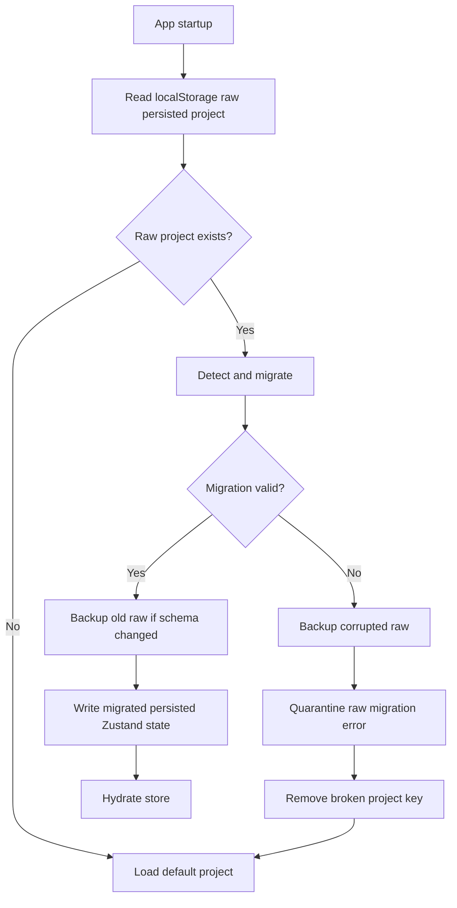

# Kia Electric Lab - Architecture

Architecture policy: append architectural decisions and changes with timestamps. Do not silently change architecture. Any major module movement, state model change, rule-engine change, or persistence change must be documented here for Mehdi and Vi.

## 2026-05-14 13:05 Europe/Istanbul - Phase 1 Architecture Baseline

### Architectural Intent

Kia Electric Lab Phase 1 is a local-first educational simulator. The architecture is intentionally frontend-only for MVP speed, but it is structured so the core simulation logic can later move into a shared package or Tauri/SQLite desktop architecture.

The most important Phase 1 architectural principle is separation of concerns:

- UI renders and collects user actions.
- Store owns editable project state.
- Data files define educational assumptions.
- Engine files calculate electrical, safety, cost, and report outputs.
- Type files define contracts between all modules.

### Current Folder Structure

```text
src/
  components/
    Icon.tsx
    StatCard.tsx
  data/
    apartment.ts
    appliances.ts
    electricalTables.ts
  features/
    appliance-library/
      ApplianceLibrary.tsx
    circuit-builder/
      CircuitBuilder.tsx
    cost-engine/
      CostPanel.tsx
      costEngine.ts
    floor-plan/
      FloorPlan.tsx
    report-engine/
      ReportPanel.tsx
      reportEngine.ts
      reportEngine.test.ts
    safety-engine/
      electricalMath.ts
      electricalMath.test.ts
      SafetyPanel.tsx
      safetyEngine.ts
  store/
    useLabStore.ts
  types/
    electrical.ts
  utils/
    format.ts
  App.tsx
  main.tsx
  styles.css
```

### Module Responsibilities

#### `src/types/electrical.ts`

Defines the shared domain contract for the entire simulator:

- Appliance model
- Room model
- Electrical component model
- Circuit model
- Wire model
- Breaker model
- Cost item model
- Safety warning model
- Project report model
- Complete electrical project model

This file is the current source of truth for project data shape.

#### `src/data/appliances.ts`

Defines the Phase 1 common appliance library. Each appliance has:

- ID
- Persian display name
- Wattage
- Voltage
- Category
- Icon key

The category is used by the safety engine to identify lights, heavy loads, stable loads, and normal small loads.

#### `src/data/electricalTables.ts`

Defines the simplified educational tables for:

- Wire size
- Wire ampacity
- Wire price per meter
- Wire resistance per meter
- Breaker ratings
- Breaker prices
- Unit material and labor costs

Future architecture recommendation: convert this into a versioned profile file so cost and rule assumptions can vary by lesson, market, or country.

#### `src/data/apartment.ts`

Defines:

- Room geometry for the default 100 sqm apartment.
- Initial visible components.
- Default demo project and starter circuits.

This is currently static data. Future versions should allow selectable apartment templates.

#### `src/store/useLabStore.ts`

Owns application state:

- `project`
- `selectedCircuitId`
- `darkMode`

Owns state mutations:

- Reset project
- Add component
- Add circuit
- Select circuit
- Update circuit
- Assign appliance to circuit
- Assign component to circuit

Persistence:

- Uses Zustand `persist` middleware.
- Storage key: `kia-electric-lab-project`.
- Persists project, selected circuit, and dark mode.

Architectural risk:

- No schema version or migration exists. This must be addressed before long-term persistence or Tauri migration.

#### `src/features/safety-engine/electricalMath.ts`

Pure electrical calculation layer:

- Current
- Power
- Resistance
- Total load
- Circuit load
- Wire lookup
- Wire capacity validation
- Breaker/wire compatibility validation
- Approximate voltage drop
- Project total load

This file should remain UI-independent.

#### `src/features/safety-engine/safetyEngine.ts`

Rule evaluation layer:

- Creates Persian warnings.
- Checks whole-project overload.
- Checks circuit overload.
- Checks wire capacity.
- Checks breaker-wire compatibility.
- Checks multiple heavy appliances.
- Checks mixed lighting/outlet loads.
- Checks approximate voltage drop.
- Checks overdesign.
- Checks refrigerator stability/dedication.
- Checks kitchen circuit count.
- Checks bathroom outlet risk.
- Checks unknown appliance IDs.

Architectural risk:

- Rules are currently procedural. As the platform grows, this should become a rule registry or profile-based rule engine.

#### `src/features/cost-engine/costEngine.ts`

Cost calculation layer:

- Calculates circuit-level cost items.
- Calculates material cost.
- Calculates labor cost.
- Calculates total circuit cost.
- Calculates approximate overdesign cost.
- Aggregates project cost.
- Calculates cost by circuit and room.

Architectural risk:

- Cost model is hardcoded.
- Currency is implicit.
- Cost values have no effective date/version.
- Room cost distribution is approximate.

#### `src/features/report-engine/reportEngine.ts`

Report and scoring layer:

- Generates full `ProjectReport`.
- Aggregates loads, costs, warnings, wire usage, economic suggestions, recommended corrections, and scores.
- Calculates scores from warning counts, configured circuit count, kitchen separation, and overdesign cost.

Architectural risk:

- Scoring weights are hardcoded and should eventually be configurable by lesson mode.

#### UI Components

UI modules consume state and engine outputs:

- `App.tsx`: page layout, RTL enforcement, dashboard cards.
- `ApplianceLibrary.tsx`: component/appliance palette and drag data.
- `FloorPlan.tsx`: apartment visualization and drag/drop placement.
- `CircuitBuilder.tsx`: circuit list and circuit configuration controls.
- `SafetyPanel.tsx`: warning display.
- `CostPanel.tsx`: cost summary display.
- `ReportPanel.tsx`: final report display.

### State Flow

Current flow:

1. Static defaults are loaded from `src/data/apartment.ts`.
2. Zustand initializes `project` state with `defaultProject`.
3. Zustand persistence restores previous local browser state if available.
4. User actions mutate state through store actions.
5. UI components read project state through `useLabStore`.
6. UI components call pure engines with current project data.
7. Engines return derived values.
8. UI renders Persian dashboard, safety warnings, cost outputs, and report.

Important: derived values are not currently stored. They are recalculated from project state. This is good for correctness and avoids stale derived state.

### Simulation Engine Design

Phase 1 does not have a single `simulationEngine` module. Instead, simulation concerns are split by responsibility:

- Electrical math: `electricalMath.ts`
- Safety rules: `safetyEngine.ts`
- Cost calculations: `costEngine.ts`
- Report and scoring: `reportEngine.ts`

This is acceptable for MVP. For Phase 2 or Phase 3, consider introducing:

- `simulation-profile`
- `rule-registry`
- `project-normalizer`
- `project-validator`
- `report-snapshot`

### UI Architecture

The UI is card-based and Persian RTL. It uses TailwindCSS classes directly in components.

Layout:

- Header and top KPI cards in `App.tsx`.
- Main content grid with:
  - Left: palette/library
  - Center: floor plan, circuit builder, report
  - Right: safety and cost panels

React Flow architecture:

- Rooms are rendered as non-draggable background nodes.
- Components are rendered as nodes over rooms.
- Circuit membership is visualized with edges from main panel to assigned components.
- Drag/drop uses `dataTransfer` payloads and `screenToFlowPosition`.

Limitations:

- Nodes are not draggable after placement.
- Wire path geometry is not modeled.
- Edges are not true electrical topology.

### Safety Engine Architecture

Current safety engine inputs:

- `ElectricalProject`
- Each `Circuit`
- Appliance table
- Wire table

Current safety engine output:

- Array of `SafetyWarning`.

Warning levels:

- `danger`
- `warning`
- `info`

Current safety engine behavior:

- Evaluates whole-project rules first.
- Evaluates each circuit.
- Evaluates cross-cutting room/appliance conditions.
- Returns warnings for UI and report engine.

Future safety architecture:

- Convert rules to typed rule objects.
- Add rule IDs and categories.
- Add severity policy by lesson mode.
- Add unit tests per rule.
- Add explainable rule metadata:
  - trigger
  - formula
  - educational explanation
  - recommended correction
  - professional disclaimer

### Cost Engine Architecture

Current cost engine inputs:

- `Circuit`
- Optional `ElectricalProject`
- Wire table
- Breaker table
- Unit cost table

Current cost engine output:

- Circuit-level items and totals.
- Project-level aggregate totals.

Current cost categories:

- material
- labor

Current cost limitations:

- Costs are static placeholders.
- Currency is displayed as toman in UI but not encoded in data model.
- No supplier or date metadata.
- No regional pricing.
- No uncertainty range.

Future cost architecture:

- Versioned cost profile.
- Currency metadata.
- Effective date.
- Editable cost assumptions.
- Import/export of cost profiles.
- Overdesign explanation with exact alternative wire recommendation.

### Report Engine Architecture

The report engine composes:

- Project load from electrical math.
- Cost totals from cost engine.
- Safety warnings from safety engine.
- Wire usage from circuits.
- Economic suggestions from overdesign warnings.
- Recommended corrections from non-info warnings.
- Scores from warning and configuration heuristics.

This module is the correct place to prepare AI tutor context in later phases, because it already composes the complete educational state.

### Data Model Relationships

High-level relationship:

```text
ElectricalProject
  voltage
  mainBreakerAmp
  rooms[]
  components[]
  circuits[]

Circuit
  roomIds[] -> Room.id
  componentIds[] -> ElectricalComponent.id
  applianceIds[] -> Appliance.id
  wireSizeMm2 -> Wire.sizeMm2
  breakerAmp -> Breaker.amp
```

Important current design note:

- Appliances are not component instances. Circuits store `applianceIds`, and components may also reference `applianceId`.
- This is enough for MVP but may become limiting when the same appliance type appears multiple times.

Future recommendation:

- Introduce `PlacedLoad` or `LoadInstance` with unique ID, appliance type, room, circuit, and custom wattage override.

### Persistence Architecture

Current:

- Browser local storage via Zustand.

Missing:

- Version number.
- Migration system.
- Data validation.
- Project import/export.
- Conflict recovery.

Future:

- Add `schemaVersion` to `ElectricalProject`.
- Add local migrations.
- Add JSON import/export.
- Add SQLite adapter for Tauri.
- Keep engines storage-agnostic.

### Testing Architecture

Current:

- Vitest configured.
- Tests exist for electrical math and report generation.

Missing:

- UI tests.
- Store tests.
- Rule-by-rule safety tests.
- Cost engine tests.
- Persistence migration tests.
- Visual regression tests.

Recommended testing direction:

1. Add cost engine unit tests.
2. Add safety warning unit tests per rule.
3. Add store mutation tests.
4. Add Playwright/Codex browser smoke tests after UI stabilizes.

### Architecture Quality Assessment

The current architecture is strong for Phase 1. It satisfies the most important principle: calculation logic is not embedded directly inside UI components. The data model is clear, and feature directories make ownership reasonably obvious.

The largest architectural gap is that the simulator does not yet distinguish visual topology from electrical topology. React Flow currently renders visual nodes and simple edges, but the true circuit model is still a list of circuits with IDs. This is fine for MVP but must be addressed before advanced circuit simulation, automatic wire-length calculation, or multiplayer editing.

### Architectural Risks

- UI can become too large if future features are added directly to existing components.
- Procedural safety rules can become hard to manage without a rule registry.
- Static data tables can become hard to version without profiles.
- Local storage can break across schema changes.
- Appliance IDs as load references are too coarse for repeated identical appliances.
- No single source of truth exists for visual wire path geometry.

### Architectural Next Steps

Recommended Phase 2 architecture work:

- Add `.gitignore` and initialize repository.
- Add schema version to `ElectricalProject`.
- Introduce `LoadInstance` or `PlacedLoad`.
- Add safety rule registry abstraction.
- Add cost profile abstraction.
- Add project import/export.
- Add circuit/component deletion and editing.
- Add tests around safety and cost engines.

## 2026-05-14 13:25 Europe/Istanbul - Version Control Architecture

### Change Type

Engineering-process architecture. No runtime source architecture changed.

### Git Branch Architecture

The project now uses:

- `main` for stable releases.
- `develop` for active integration.
- `feature/*` for isolated work.
- `experimental/*` for risky prototypes and research.

### Baseline Anchor

The tag `v0.1-phase1-baseline` marks the stable Phase 1 baseline. This tag is the first formal recovery anchor for the project.

### Documentation Coupling

Future architecture, electrical-rule, cost-rule, and persistence changes must include corresponding updates under `project-docs/` before they are considered complete.

### Reason

Kia Electric Lab is expected to grow into a larger educational simulator and AI-assisted platform. Branch strategy and tagged baselines are required to preserve architectural continuity and allow safe rollback.

## 2026-05-14 13:40 Europe/Istanbul - Phase 2 Topology Engine Architecture

### Change Type

Runtime simulation architecture.

### Architecture Goal

Make the electrical engine the source of truth for circuit connectivity while keeping React Flow as visualization only.

### New Module Layout

```text
src/features/
  topology-engine/
    types.ts
    terminalCatalog.ts
    topologyEngine.ts
    topologyEngine.test.ts
  current-engine/
    currentEngine.ts
  validation-engine/
    validationEngine.ts
```

### Module Responsibilities

#### `topology-engine/types.ts`

Defines graph-level types:

- `ElectricalTerminal`
- `TopologyNode`
- `TopologyWire`
- `ElectricalTopologyGraph`
- terminal key helpers
- wire helper utilities

#### `topology-engine/terminalCatalog.ts`

Defines electrical terminals exposed by component types:

- Main panel:
  - `phase-source`
  - `neutral-source`
- Virtual breaker:
  - `line-in`
  - `load-out`
- Physical breaker:
  - `line-in`
  - `load-out`
- One-way switch:
  - `line-in`
  - `line-out`
- Two-gang switch:
  - `line-in`
  - `line-out-1`
  - `line-out-2`
- Outlet/lamp/appliance:
  - `phase`
  - `neutral`
- Junction box:
  - phase junction
  - neutral junction
- Wire path:
  - endpoint A
  - endpoint B

#### `topology-engine/topologyEngine.ts`

Builds the graph:

- Converts project components into topology nodes.
- Creates virtual breaker nodes for each circuit.
- Converts explicit `project.wires` into topology edges when available.
- Generates deterministic educational wires from circuit membership when explicit wires are absent.
- Builds adjacency maps for traversal.
- Provides terminal traversal.

Important design:

- Generated topology is a compatibility bridge, not a substitute for future wire-routing UI.
- Explicit wires will become the authoritative topology once UI supports drawing wires.

#### `current-engine/currentEngine.ts`

Simulates simplified educational current flow:

- Finds load components.
- Checks phase/neutral connectivity.
- Calculates load current from appliance watts.
- Calculates total current per breaker/circuit.
- Calculates current through each wire.
- Calculates voltage drop per wire.
- Flags wire overloads.

#### `validation-engine/validationEngine.ts`

Creates graph-based Persian warnings:

- Missing/invalid breaker path.
- Open phase.
- Open neutral.
- Incomplete loop.
- Invalid switch wiring.
- Direct phase-neutral short.
- Breaker overload from graph load.
- Wire overload from propagated current.

### Source Of Truth Rule

Electrical connectivity must be read from the topology engine, not from React Flow edges.

React Flow may display:

- Rooms.
- Components.
- Visual connections.
- Future wire paths.

But React Flow must not own:

- Electrical terminals.
- Circuit validity.
- Current propagation.
- Safety conclusions.
- Wire overload logic.

### Data Model Change

`ElectricalProject` now supports optional `wires?: ElectricalWire[]`.

`ElectricalWire` includes:

- `id`
- `circuitId`
- `from`
- `to`
- `lengthMeters`
- `wireSizeMm2`
- optional Persian label

This creates the future bridge to real wire-routing UI.

### Current Topology Generation Strategy

When explicit wires do not exist:

1. A virtual breaker node is created for each circuit.
2. Panel phase is connected to breaker input.
3. Breaker output connects to load phase terminals.
4. Load neutral terminals connect to panel neutral.
5. If a switch exists in a lighting circuit, generated phase routing can pass through the switch before lamp phase.

This generated graph is deterministic and testable. It allows Phase 1 projects to be analyzed by Phase 2 engines immediately.

### Scalability Notes

This architecture can later support:

- Real wire routing.
- Advanced voltage drop.
- Three-phase systems.
- Grounding systems.
- Smart-home simulation.
- Solar systems.
- UPS systems.
- Generator backup.

Required future evolution:

- Add `TopologyProfile` or `SystemProfile`.
- Add grounding terminal roles.
- Add multi-phase terminal roles.
- Add protective device models.
- Add explicit switch-state simulation.
- Add graph normalization and validation for large projects.

### Architecture Risks

- Generated topology can hide missing visual wire-routing UI if not clearly documented.
- Current engine assumes educational radial/branch behavior, not a full circuit solver.
- `main-panel` is still treated as the canonical panel ID in parts of validation/current logic.
- Load instances are still tied to component `applianceId`; repeated identical loads need a `LoadInstance` model.

### Next Architecture Step

Implement real wire-routing UI that writes explicit `ElectricalWire[]` to project state. After that, generated topology should remain only as a migration/fallback mode.

## 2026-05-14 14:20 Europe/Istanbul - Phase 3 Wire Routing UI Architecture

### Change Type

UI and state architecture connected to the Phase 2 topology engine.

### Core Rule

`ElectricalWire[]` is now the user-authored electrical source of truth when present. React Flow renders wire edges from that state but does not own simulation truth.

### New Module

```text
src/features/wire-routing/
  WireRoutingPanel.tsx
```

### Updated Modules

- `src/features/floor-plan/FloorPlan.tsx`
- `src/store/useLabStore.ts`
- `src/features/topology-engine/wireFactory.ts`
- `src/features/topology-engine/wireFactory.test.ts`
- `src/features/topology-engine/terminalCatalog.ts`
- `src/types/electrical.ts`

### State Flow

1. User enables wire drawing mode.
2. User clicks a terminal rendered on a component or virtual breaker.
3. Store records `pendingTerminal`.
4. User clicks a second terminal.
5. Store calls pure `createElectricalWire`.
6. `wireFactory` validates terminal compatibility.
7. If valid, store appends the wire to `project.wires`.
8. Floor plan renders the explicit wire.
9. Topology engine uses `project.wires` as graph edges.
10. Current engine and validation engine calculate status from explicit topology.

### Terminal Rendering

Terminals are rendered from the terminal catalog:

- Panel: phase, neutral, earth placeholder.
- Virtual breaker: line input, load output.
- Switches: line input and switched outputs.
- Outlet: phase, neutral, earth placeholder.
- Lamp/appliance: phase and neutral.

### Wire Inspector Architecture

`WireRoutingPanel` composes:

- Store wire state.
- Current simulation results.
- Terminal lookup from topology graph.
- Wire validation.
- Wire catalog data.
- Cost estimate.
- Topology warnings.

It does not calculate electrical truth independently; it displays outputs from engines.

### Remaining Architecture Limitation

React Flow edges are used to visually draw wires between component nodes. This is acceptable because the edge list is derived from `ElectricalWire[]`. The edge layer must never become the source of truth.

### Next Architecture Step

Add real path geometry for wires so a wire can have intermediate route points and measured length instead of a manually edited length.

## 2026-05-14 15:00 Europe/Istanbul - Phase 4 Geometry And Panelboard Architecture

### Change Type

Simulation geometry, UI architecture, panelboard validation, and cost integration.

### New Modules

```text
src/features/topology-engine/
  terminalGeometry.ts
  wireGeometry.ts
  wireGeometry.test.ts
src/features/panelboard-engine/
  panelboardEngine.ts
  panelboardEngine.test.ts
src/features/panelboard/
  PanelboardPanel.tsx
```

### Geometry Architecture

`terminalGeometry.ts` owns:

- default pixels-per-meter scale
- terminal coordinate calculation
- virtual breaker coordinates
- snap-to-grid behavior

`wireGeometry.ts` owns:

- path-point assembly from terminal start, bend points, and terminal end
- pixel length calculation
- pixel-to-meter conversion
- wire length calculation
- bend insertion
- bend update
- bend deletion
- route reset

### Source Of Truth Rule

`ElectricalWire[]` remains source of truth. React Flow is only used to display rooms/components. Routed wires are drawn as SVG polylines derived from explicit wire data and terminal geometry.

### Panelboard Architecture

Panelboard data is optional:

- If `project.panelboard` exists, it is used.
- If it does not exist, panelboard UI derives default slots from existing circuits for backward compatibility.

`panelboardEngine.ts` validates:

- circuit without breaker
- breaker without circuit
- overloaded breaker
- breaker/wire incompatibility

### Cost Architecture

Cost engine now uses geometric explicit wire length for circuits when `project.wires` exist. If no explicit wires exist, it falls back to circuit estimated length for Phase 1 compatibility.

### Remaining Architecture Limitations

- Wire route points are simple bend coordinates, not full conduit/routing objects.
- Terminal coordinates are deterministic offsets from component positions, not DOM-measured handle coordinates.
- Panelboard slots are educational and simple; no physical DIN rail/panel layout model yet.

## 2026-05-14 15:25 Europe/Istanbul - Phase 5 Persistence And Migration Architecture

### Change Type

Project schema governance, local storage safety, migration, backup, restore, and data integrity validation.

### New Modules

```text
src/migrations/
  projectMigration.ts
  storageSafety.ts
  projectMigration.test.ts

src/features/project-data/
  ProjectDataPanel.tsx
```

### Schema Ownership

`ElectricalProject` now owns persistent metadata:

- `schemaVersion`
- `appVersion`
- `createdAt`
- `updatedAt`

This metadata travels with the project object rather than only the storage layer. That makes the schema portable to future Tauri + SQLite, JSON export/import, and possible shared project files.

### Migration Engine Design

`projectMigration.ts` is pure TypeScript:

- `detectProjectVersion(project)`
- `migrateProject(project)`
- `validateMigratedProject(project)`
- `parsePersistedProject(raw)`

Detection supports:

- Phase 1 shape: no wires/schema metadata
- Phase 2 shape: `wires` exists
- Phase 3 shape: explicit wires with `kind`
- Phase 4 shape: `pixelsPerMeter` or `panelboard`
- Phase 5 shape: explicit `schemaVersion`

Migration is deterministic and upgrades all known old shapes to current schema version 5.

### Storage Safety Flow



### State Flow

- `storageSafety.preparePersistedProjectStorage()` runs before Zustand `persist` hydration.
- Zustand hydrates only a valid latest-shape project or the safe default project.
- Store actions update `updatedAt`, `schemaVersion`, and `appVersion` through `touchProject`.
- `ProjectDataPanel` can replace the current project after import/restore using `replaceProject`.

### UI Architecture

`ProjectDataPanel` is an operational tool panel in the right-side column. It shows:

- schema version
- app version marker
- last saved time
- export JSON button
- import JSON button
- safe reset button
- automatic backup list
- corrupted data export when quarantine exists

The panel does not calculate simulation results. It only manages project persistence state.

### Validation Boundary

Migration validation confirms structural integrity, not professional electrical approval. It checks arrays, schema version, route points, wire terminal references, breaker assignment references, breaker amps, and scale. Electrical safety remains owned by the topology, validation, safety, panelboard, and cost engines.

### Future Architecture Notes

- SQLite migration should call the same pure migration engine before opening/saving project rows.
- Schema version should also be stored at database level when Tauri arrives.
- Future project sharing/multiplayer will need merge/conflict semantics beyond this single-document migration model.
